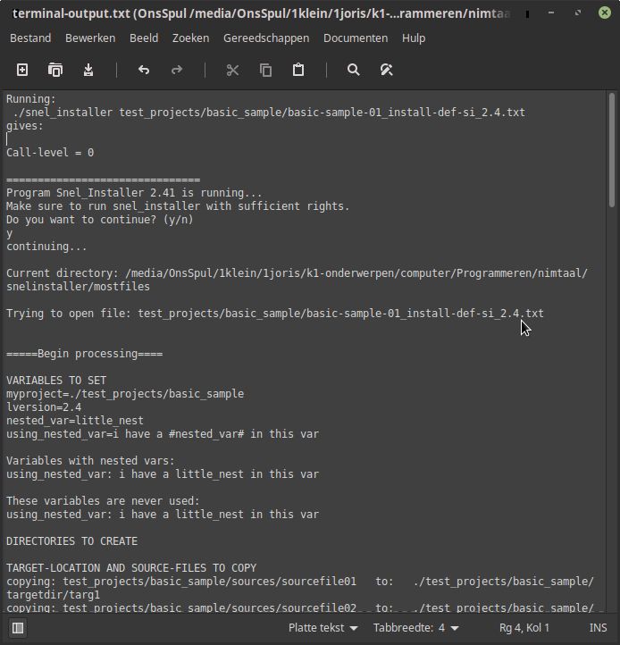

## SnelInstaller - lightweight text-based installer

[Go to Sample-definition-file] (https://github.com/some-avail/snelinstaller/blob/main/mostfiles/test_projects/basic_sample/basic-sample-01_install-def-si_2.4.txt)

[Go to sample terminal-output after running] (https://github.com/some-avail/snelinstaller/blob/main/mostfiles/terminal-output.txt)

[Go to the user-manual] (https://github.com/some-avail/snelinstaller/blob/main/mostfiles/manual-snel-installer.txt)

[Go to what-is-new.txt] (https://github.com/some-avail/snelinstaller/blob/main/mostfiles/what-is-new.txt)

SnelInstaller (SI) is text-based program meant to easify the creation of installation-packages, or the adjustment of configurations in your operating-system. For example you can easily create a .deb package (once you've created a definition), or the preparation of a windows-setup. However it is not like Inno-setup, but once you have created an Inno-setup, you can update the Inno-setup-definitions automatically using SnelInstaller.

With SI you can create dirs, copy files, edit files (for now linux-only) and execute commands automatically, that is, based on a install-definition-file. Also you can call other installations / def-files. You are not limited to any specific programming-langage or environment. Besides installation-packages it can be helpfull in creating any computer-configuration for example to customize a standard-computer to the needs of an organisation. It can even be helping in the creation of a Linux-distribution.

Features:
- simplicity; easy-to-understand definition-files do the trick, and the manual is compact.
- variables can be defined for file-handling, especially usable for paths, to avoid repetitive input of long paths.
- flexibility; because of recurrency, one def-file can call one or more other ones, and so on..

SnelInstaller is written in the advanced programming-language Nim; a modern, compiled, garbage-collected language with Python-like syntax.

SI has been developped on / and released for Linux (which I use obviously) but I have tested it on Windows aswell. However, it failed on the edit-file-function, the reason being differences in line-endings. The other functions work OK though, which is about 85 %. Therefore I have published a windows-release as a beta-program. If there is interest, I may put time in adapting the edit-function for windows. (or generalizing it: some sort of line-ending detection would be necessary?).

Anyway, success with trying out SnelInstaller.

